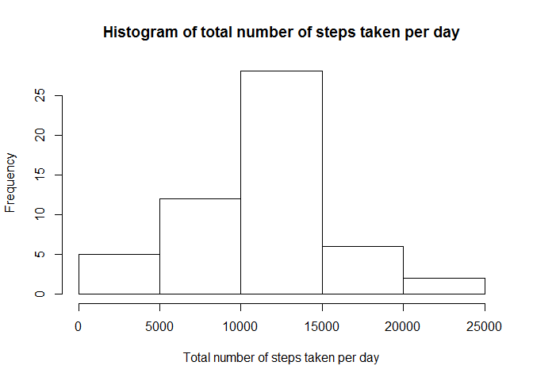
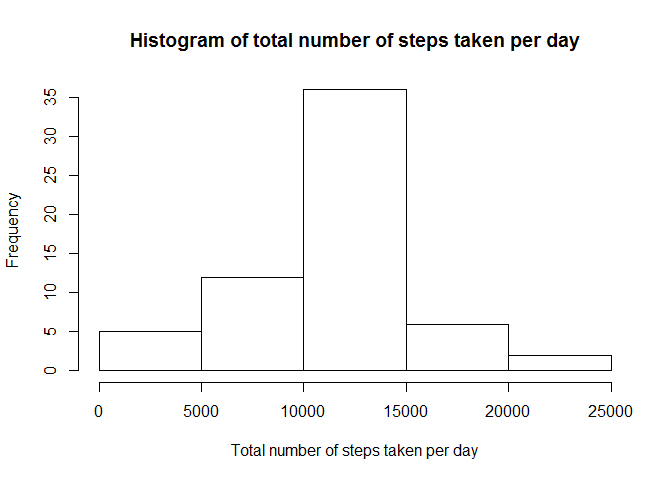

# Reproducible Research: Peer Assessment 1


## Loading and preprocessing the data


```r
unzip("activity.zip")
activity <- read.csv("activity.csv", stringsAsFactors = FALSE)
```

## What is mean total number of steps taken per day?


```r
totalstepsperday <- tapply(activity$steps, activity$date, sum)
totalstepsperday
```

```
## 2012-10-01 2012-10-02 2012-10-03 2012-10-04 2012-10-05 2012-10-06 
##         NA        126      11352      12116      13294      15420 
## 2012-10-07 2012-10-08 2012-10-09 2012-10-10 2012-10-11 2012-10-12 
##      11015         NA      12811       9900      10304      17382 
## 2012-10-13 2012-10-14 2012-10-15 2012-10-16 2012-10-17 2012-10-18 
##      12426      15098      10139      15084      13452      10056 
## 2012-10-19 2012-10-20 2012-10-21 2012-10-22 2012-10-23 2012-10-24 
##      11829      10395       8821      13460       8918       8355 
## 2012-10-25 2012-10-26 2012-10-27 2012-10-28 2012-10-29 2012-10-30 
##       2492       6778      10119      11458       5018       9819 
## 2012-10-31 2012-11-01 2012-11-02 2012-11-03 2012-11-04 2012-11-05 
##      15414         NA      10600      10571         NA      10439 
## 2012-11-06 2012-11-07 2012-11-08 2012-11-09 2012-11-10 2012-11-11 
##       8334      12883       3219         NA         NA      12608 
## 2012-11-12 2012-11-13 2012-11-14 2012-11-15 2012-11-16 2012-11-17 
##      10765       7336         NA         41       5441      14339 
## 2012-11-18 2012-11-19 2012-11-20 2012-11-21 2012-11-22 2012-11-23 
##      15110       8841       4472      12787      20427      21194 
## 2012-11-24 2012-11-25 2012-11-26 2012-11-27 2012-11-28 2012-11-29 
##      14478      11834      11162      13646      10183       7047 
## 2012-11-30 
##         NA
```

```r
hist(totalstepsperday, main = "Histogram of total number of steps taken per day", xlab = "Total number of steps taken per day")
```

 

```r
options(scipen = 999)
meanstepsperday <- mean(totalstepsperday, na.rm = TRUE)
medianstepsperday <- median(totalstepsperday, na.rm = TRUE)
```

The mean of the total number of steps taken per day is 10766.1886792.  
The median of the total number of steps taken per day is 10765.

## What is the average daily activity pattern?


```r
meanstepsperinterval <- tapply(activity$steps, activity$interval, mean, na.rm = TRUE)
plot(meanstepsperinterval, type = "l", main = "Average daily activity pattern", xlab = "5-minute interval", ylab = "Average number of steps taken across all days", xaxt = "n")
axis(1, at = seq(0, 250, 50), labels = seq(0, 2050, 410))
```

 

```r
maxinterval <- names(meanstepsperinterval[meanstepsperinterval == max(meanstepsperinterval)])
```

The 5-minute interval, on average across all the days in the dataset, that contains the maximum number of steps is 835.

## Imputing missing values


```r
missing <- sum(is.na(activity$steps))
```

The total number of missing values in the dataset is 2304.  
I will be using the mean number of steps for each 5-minute interval to fill in all of the missing values in the dataset.


```r
newactivity <- activity
newactivity$steps[is.na(newactivity$steps)] <- meanstepsperinterval
newtotalstepsperday <- tapply(newactivity$steps, newactivity$date, sum)
newtotalstepsperday
```

```
## 2012-10-01 2012-10-02 2012-10-03 2012-10-04 2012-10-05 2012-10-06 
##   10766.19     126.00   11352.00   12116.00   13294.00   15420.00 
## 2012-10-07 2012-10-08 2012-10-09 2012-10-10 2012-10-11 2012-10-12 
##   11015.00   10766.19   12811.00    9900.00   10304.00   17382.00 
## 2012-10-13 2012-10-14 2012-10-15 2012-10-16 2012-10-17 2012-10-18 
##   12426.00   15098.00   10139.00   15084.00   13452.00   10056.00 
## 2012-10-19 2012-10-20 2012-10-21 2012-10-22 2012-10-23 2012-10-24 
##   11829.00   10395.00    8821.00   13460.00    8918.00    8355.00 
## 2012-10-25 2012-10-26 2012-10-27 2012-10-28 2012-10-29 2012-10-30 
##    2492.00    6778.00   10119.00   11458.00    5018.00    9819.00 
## 2012-10-31 2012-11-01 2012-11-02 2012-11-03 2012-11-04 2012-11-05 
##   15414.00   10766.19   10600.00   10571.00   10766.19   10439.00 
## 2012-11-06 2012-11-07 2012-11-08 2012-11-09 2012-11-10 2012-11-11 
##    8334.00   12883.00    3219.00   10766.19   10766.19   12608.00 
## 2012-11-12 2012-11-13 2012-11-14 2012-11-15 2012-11-16 2012-11-17 
##   10765.00    7336.00   10766.19      41.00    5441.00   14339.00 
## 2012-11-18 2012-11-19 2012-11-20 2012-11-21 2012-11-22 2012-11-23 
##   15110.00    8841.00    4472.00   12787.00   20427.00   21194.00 
## 2012-11-24 2012-11-25 2012-11-26 2012-11-27 2012-11-28 2012-11-29 
##   14478.00   11834.00   11162.00   13646.00   10183.00    7047.00 
## 2012-11-30 
##   10766.19
```

```r
hist(newtotalstepsperday, main = "Histogram of total number of steps taken per day", xlab = "Total number of steps taken per day")
```

 

```r
newmeanstepsperday <- mean(newtotalstepsperday)
newmedianstepsperday <- median(newtotalstepsperday)
```

The mean of the total number of steps taken per day is 10766.1886792.  
The median of the total number of steps taken per day is 10766.1886792.  
The mean is the same as the first part. The median is slightly greater than the first part. Inputting the missing data has increased the frequency of days with 10000-15000 steps. This caused the median to increase. It has no impact on the mean since the strategy to fill in the missing values was to use the average number of steps.
 
## Are there differences in activity patterns between weekdays and weekends?


```r
day <- weekdays(as.Date(newactivity$date))
newactivity$day[day %in% c("Monday", "Tuesday", "Wednesday", "Thursday", "Friday")] <- "weekday"
newactivity$day[day %in% c("Saturday", "Sunday")] <- "weekend"
newactivity$day <- as.factor(newactivity$day)

library(lattice)
newmeanstepsperinterval <- tapply(newactivity$steps, interaction(newactivity$interval, newactivity$day), mean)
dat <- data.frame(steps = as.numeric(newmeanstepsperinterval), interval = newactivity$interval[1:576], day = rep(c("weekday", "weekend"), each = 288))
xyplot(steps ~ interval | day, data = dat, type = "l", layout = c(1, 2), xlab = "Interval", ylab = "Number of steps")
```

 
